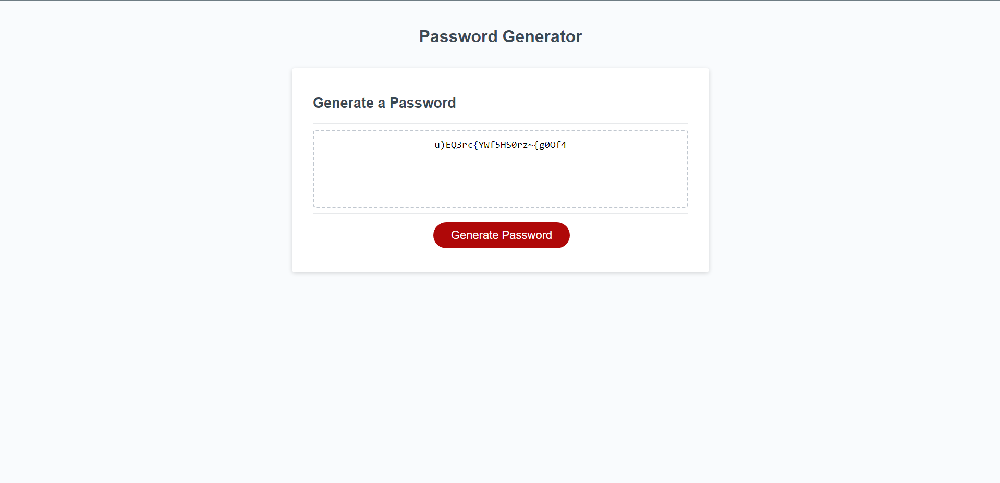
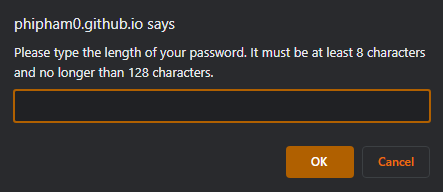
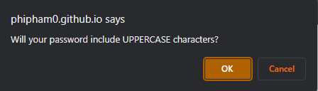
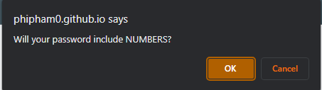
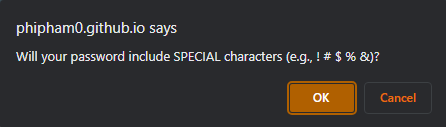

# Challenge 3: Password Generator

## Description

This project is a webpage that is displaying a password generator. A big red button is in the center of the screen, and when it is clicked, a series of prompts appears and asks the user what their
requirements are for the password. The first prompt asks the user the length of the password. It also has validations in place. If the user enters a number outside of the 8 to 128 range, then they are asked
to enter a number again. After the length, the user is asked a series of character types that are to be included in the password. These include lowercase letters, uppercase letters, numbers, and special characters. The character types also have validation. If there are zero character types selected, the user will be prompted to input their character types again. In the end, the password is generated
at the center of the screen.

This project was the most fun for me yet. I find myself to be a more logical person, and I feel like javascript is the best way to represent that out of CSS and HTML. Because of this,
I was really motivated to work through the logic of the validations using condition statements and functions. I haven't worked with prompts, confirms, and alerts before, so this was a 
great learning experience. Overall, this was a fun project, isolating my focus on purely javascript and creating the logic of the website.

## Installation

To install the project, clone the repository onto your PC.
Enter the directory that has the cloned repository and open (Double click) the index.html, style.css and script.js files to read the code and access the files.

To access the webpage, click the link below:

https://phipham0.github.io/challenge-3-password-generator/

## Usage

To start, click the red "Generate Password" button. This will ask the user to insert the number of characters in the password. Be sure to enter a number 
between 7 and 129. Anything else will be an invalid answer, and the user will be asked to enter again. After, there will be four confirms asking if the user wants
to include a character type. Clicking "OK" on the confirm will add the character type, and clicking "Cancel" will not add the character type. If no confirms are added, the user will
go through the list of prompts again. After all the prompts and confirms are added, the password will be generated inside the center text box.

## License

MIT License

Copyright (c) [year] [fullname]

Permission is hereby granted, free of charge, to any person obtaining a copy
of this software and associated documentation files (the "Software"), to deal
in the Software without restriction, including without limitation the rights
to use, copy, modify, merge, publish, distribute, sublicense, and/or sell
copies of the Software, and to permit persons to whom the Software is
furnished to do so, subject to the following conditions:

The above copyright notice and this permission notice shall be included in all
copies or substantial portions of the Software.

THE SOFTWARE IS PROVIDED "AS IS", WITHOUT WARRANTY OF ANY KIND, EXPRESS OR
IMPLIED, INCLUDING BUT NOT LIMITED TO THE WARRANTIES OF MERCHANTABILITY,
FITNESS FOR A PARTICULAR PURPOSE AND NONINFRINGEMENT. IN NO EVENT SHALL THE
AUTHORS OR COPYRIGHT HOLDERS BE LIABLE FOR ANY CLAIM, DAMAGES OR OTHER
LIABILITY, WHETHER IN AN ACTION OF CONTRACT, TORT OR OTHERWISE, ARISING FROM,
OUT OF OR IN CONNECTION WITH THE SOFTWARE OR THE USE OR OTHER DEALINGS IN THE
SOFTWARE.
